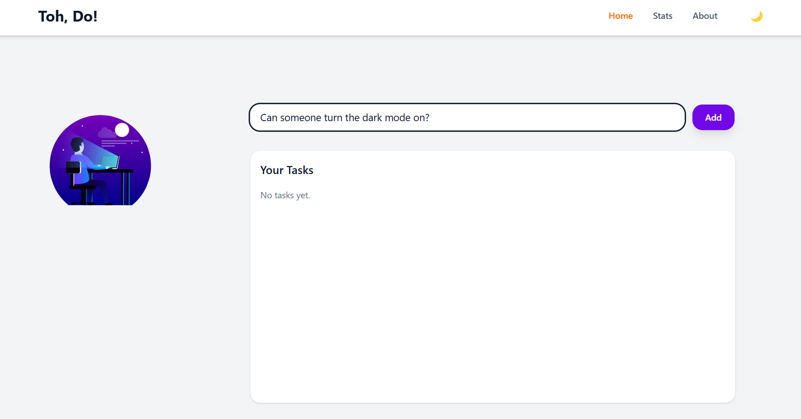
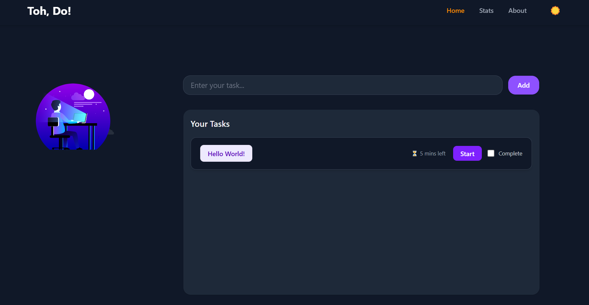
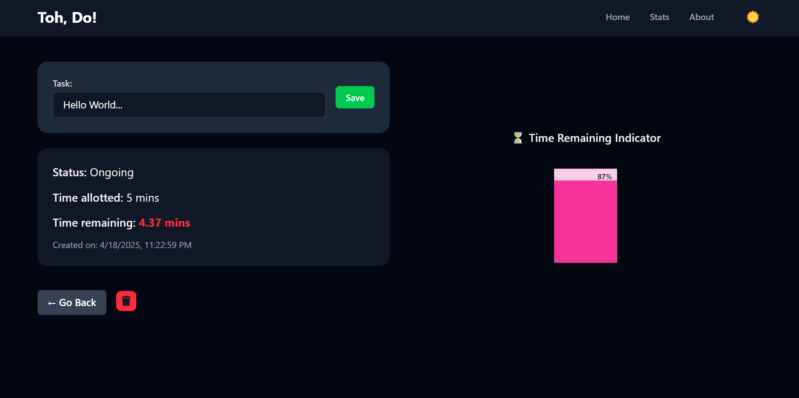
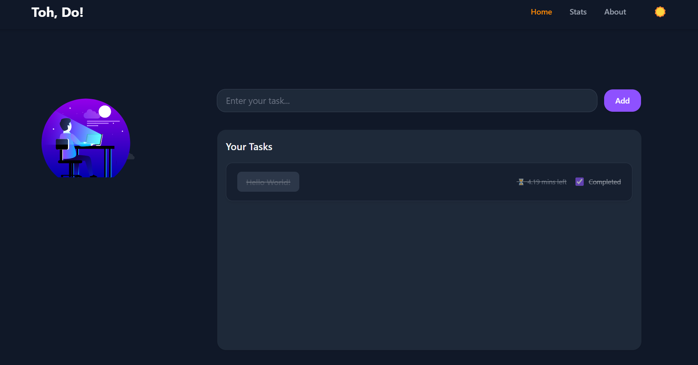

# 🗂️ Toh, Do? — A Minimalist Task Manager

**Toh, Do?** is a productivity-focused task manager built with modern web technologies. It allows users to manage their tasks efficiently with smart features like timers, dashboards, and persistent state management — all wrapped in a sleek, theme-adaptive interface.

---

## 🚀 Features

- ✅ **Add Tasks with Time Limits**  
  Quickly add tasks and specify how much time you want to spend on them.

- ⏱️ **Start, Pause, Resume**  
  Control your task timers with ease. Work at your pace.

- ✍️ **Edit Tasks Anytime**  
  Update task details even after creation.

- 🧠 **Task Dashboard**  
  View detailed information and track progress for each individual task.

- 🌗 **Dark & Light Theme Toggle**  
  Switch between elegant dark and light modes.

- 💾 **Persistent State**  
  Your tasks, themes, and timers remain intact even if you leave the site or refresh the page — powered by Redux Persist and localStorage.

- ⏳ **Visual Time Remaining**  
  Get a clear, visual representation of the remaining time for each task.

- 📊 **Insights & Stats (Coming Soon)**  
  Analyze your productivity with data on completed tasks, total time spent, and time efficiency.

---

## 🛠️ Tech Stack

- ⚛️ **React JS** — Component-based UI library  
- 🧭 **React Router** — Routing for multi-page navigation  
- 📦 **React-Redux (Redux Toolkit)** — Scalable state management  
- 🔁 **Redux Persist** — Sync Redux state to localStorage  
- 🎨 **Tailwind CSS** — Utility-first CSS framework for styling  
- 📱 **Responsive Design** — Fully responsive and mobile-friendly UI

---

## 📸 Screenshots

 
 

 
 

 
 

---
 
Feel free to contribute and give me suggestions <a href = "https://www.linkedin.com/in/pranaw-kumar-710331215/">here</a> 

 

Made with ❤️ by W.

---